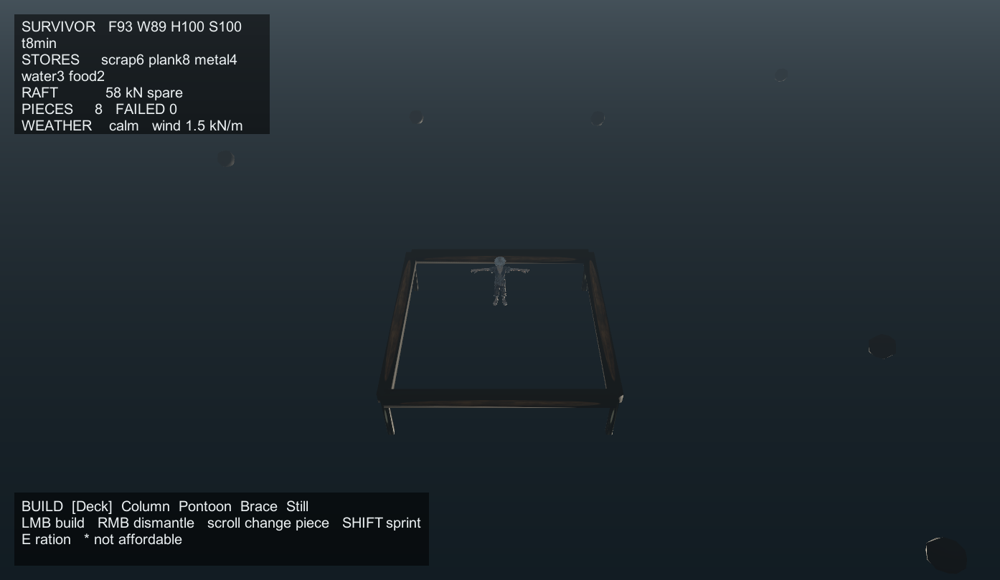

# CrazyAquarium / 狂涛纪元

海平面上升后的海上生存建造。当前状态：**可玩的灰盒垂直切片**。



## 怎么运行

**已构建的可执行文件**（70 MB）：

```
Builds/CrazyAquarium.exe
```

**从源码重新构建**：

```powershell
$unity = "C:\Program Files\Unity\Hub\Editor\2022.3.62f3c1\Editor\Unity.exe"
$proj = "C:\Users\Anantian\source\repos\CrazyAquarium"

& $unity -batchmode -nographics -quit -projectPath $proj `
  -executeMethod CrazyAquarium.EditorTools.SceneBuilder.BuildPlayer `
  -logFile "$env:TEMP\build.log"
```

或者在编辑器里：菜单 `CrazyAquarium → Build Windows Player`。

## 操作

| 键 | 作用 |
|---|---|
| WASD | 走动（相机相对） |
| Shift | 疾行 |
| 滚轮 | 切换建造件 |
| 左键 | 建造 |
| 右键 | 拆除（返还一半材料） |
| E | 吃一份口粮 |

## 现在的玩法

1. 木筏漂浮在水上，你在甲板上走动
2. 走向漂浮的残骸自动打捞，获得木板/废料/金属/淡水/食物
3. 用材料扩建：甲板、支撑柱、浮筒、斜撑、海水淡化器
4. 建造会实时调用结构求解器 —— 浮力、风载、应力
5. 生存值随时间下降：饥饿、缺水、体力、健康
6. 周期性风暴，风载从 1.2 升到 14 kN/m，可能把结构吹垮
7. 造得太重会下沉，构件会按应力从绿变红直到断裂

## 架构

```
Assets/Scripts/
├── Core/                 # 无引擎依赖，可 dotnet 直接测
│   ├── Structure/        # 求解器：重力流 + 桁架刚度法
│   ├── Game/             # 生存、库存、建造规则
│   └── Samples/          # 确定性测试夹具
├── Unity/                # 表现层，全部运行时构建
└── Tests/EditMode/       # 75 个测试
```

**关键约束：场景文件只有 180 行。** 整个世界（相机、灯光、海面、木筏、玩家）在运行时由代码生成。原因写在 `docs/progress.md` —— `.unity` 是 GUID 链接的 YAML，人和 agent 都难以可靠编辑。

## 测试

```powershell
# Unity EditMode
& "C:\Program Files\Unity\Hub\Editor\2022.3.62f3c1\Editor\Unity.exe" -batchmode -nographics `
  -runTests -testPlatform EditMode -projectPath "C:\Users\Anantian\source\repos\CrazyAquarium" `
  -testResults "$env:TEMP\results.xml" -logFile "$env:TEMP\tests.log"

# 或纯 dotnet，约 40ms，不启动编辑器
```

当前：**75/75 通过**。

## 素材来源

角色为 Meshy AI 生成（银发街机风格幸存者），模型与动画为独立 FBX 导出，
经 `SurvivorClipBaker` 重定向后烘焙进工程。

其余贴图全部 CC0，来自 [ambientCG](https://ambientcg.com)：

- `rust_Metal063.jpg` — Metal 063
- `woodfloor_WoodFloor064.jpg` — Wood Floor 064
- `wood_Wood035.jpg` — Wood 035
- `concrete_Concrete034.jpg` — Concrete 034
- `plaster_Plaster001.jpg` — Plaster 001

### 角色动画管线

Meshy 把角色和动画导出成一批互不兼容的 FBX，直接把动画套到角色上会失败。
`SurvivorClipBaker`（菜单 `CrazyAquarium/Bake Survivor Animation`）负责解决：

1. **曲线路径重映射** — 动画骨架叫 `target_character/mixamorig:Hips`，角色骨架叫
   `Armature/Hips`。baker 按最长无歧义后缀匹配把每条曲线落到角色真实骨骼上。
2. **绑定姿势差分重定向** — 每个 FBX 的参考姿势都不同（角色 `LeftArm` 静止角
   `(352,240,2)`，Idle 导出是 `(49,275,77)`，游泳是 `(50,264,3)`）。动画存的是绝对
   局部旋转，直接套用会让双臂举过头顶、头部前俯。每条曲线按
   `charRest * inverse(animRest) * src(t)` 换算，逐文件读取各自的参考姿势。
3. **烘焙为 `.anim` + AnimatorController** — FBX 里的 clip 是子资源，运行时无法按名
   加载。baker 输出独立 `.anim` 和 `Survivor.controller`，运行时用 `Animator.Play`。

baker 自动发现 `Assets/Art/Characters/Survivor/Animations/` 下的所有 FBX，文件名去掉
`Survivor_` 前缀即 Animator 状态名，新增动画不需要改代码。

已接入 **12 个状态**：`Idle`、`Walk`、`Run`、`Jump`、`JumpObstacle`、`SwimIdle`、
`SwimForward`、`LadderMountStart`、`LadderClimbLoop`、`LadderClimbFinish`、
`RopeHangIdle`、`RopeSwingToGround`。当前玩法只用到 Idle / Walk / Run，其余已烘焙
待接线（游泳和梯子/绳索都还没有对应的玩法）。

烘焙后仍需**渲染验证**：路径全对、零未命中解析，也不代表姿势正确。绑定姿势错配
只有出图才能发现。

## 已知问题

- **角色是 T-pose**：Meshy 的动画全部以“双臂水平张开”为中立姿势，实测 Idle 循环
  全程 `LeftArm` 只变化 7°（`(352,240,2)` → `(345,246,5)`），所以角色像稻草人。
  需要在肩/上臂骨骼上加一个下垂校正偏移。这是授权姿势问题，不是管线问题。
- **8/14 个漂浮物无法拾取**：玩家被限制在 ±15.6 m 甲板上，拾取物分布在 12–34 m
  环上，最远的一个玩家最近只能站到 17.88 m，而拾取判定半径只有 1.9 m。需要允许
  下水游泳，或把拾取环收进可达范围。见 `docs/progress.md`
- **画面偏暗**：环境光和雾需要调
- **没有音效**
- **斜撑效果在单跨度下不明显**：纯轴力模型不含弯曲刚度，见 `docs/research.md` 3.5.3
- **没有存档**
- **部分骨骼未烘焙**：模型缺少 `LeftToe_End` 等末端辅助骨骼，`Spine1` 与模型侧
  `Spine01` 命名不一致，这部分脊柱与脚趾不动

## 文档

- `docs/research.md` — 市场调研 + 策划案 + 技术验证实测数据
- `docs/plan.md` — 待办计划、验收标准、风险登记
- `docs/progress.md` — 环境事实、验证命令、bug 根因
- `docs/unity-cli.md` — UnityCLI 实时调试用法
